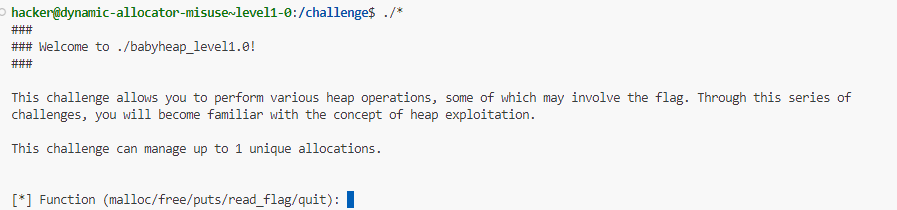
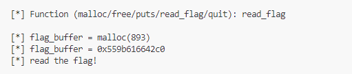
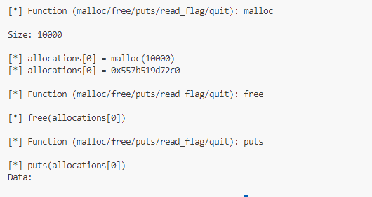
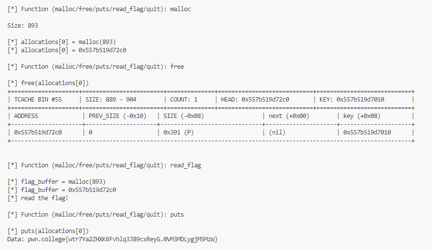
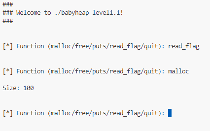
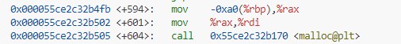
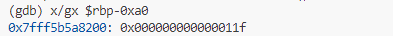
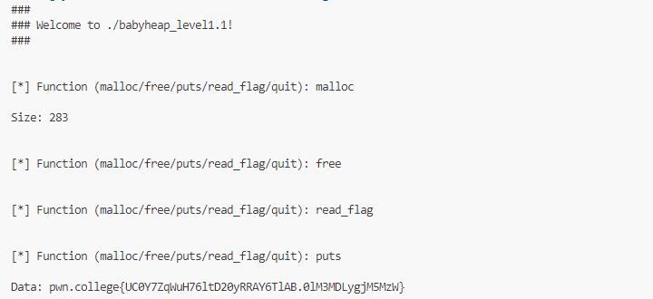

# 1.0

- Level cho ta các function để lựa chọn
- Thấy có function `read_flag`
 
- `read_flag` sẽ gọi `malloc` và flag sẽ được lưu tại đó
- Xem hàm còn lại

- Để đọc flag thì cần `flag_buffer` bằng địa chỉ của `allocations[0]`
- Cần `malloc` với kích thước bằng với kích thước `flag_buffer` đã `malloc`, sau đó `free` và gọi lại hàm `read_flag`, khi đó chunk với kích thước đó sẽ được sử dụng lại và sẽ đọc được flag

# 1.1
- Level này không cho ta biết được hàm `read_flag` sẽ malloc với kích thước bao nhiêu

- Debug để xem đã malloc với kích thước là bao nhiêu 

- ta thấy trước khi malloc thì tham số `rdi` được lấy từ `rbp-0xa0` , đặt breakpoint tại hàm `malloc` và xem tại địa chỉ `rbp-0xa0`

> 0x11f = 287
- Tương tự level 1.0
