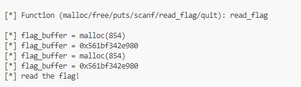

# Double Free
- Để kiểm tra con trỏ của của chunk được giải phóng thì tcache sẽ kiểm tra fias trị của khóa `key`
- Khi một chunk đã được giải phóng và ta có thể thay đổi giá trị tại khóa `key` của chunk đó thì ta có thể double free lại chunk đó
- Khi đó con trỏ `next ptr` sẽ được trỏ vào chính nó
# 4.0

- level này tương tự cần malloc 2 lần để đọc được flag
- Ta làm tương tự các level trước

- Nhưng chương trình chỉ cho phép malloc và free 1 chunk
- Level này cần double free để sử dụng lại chunk để free trước đó 
- Chương trình có function `scanf` cho phép ta nhập dữ liệu tại `allocations[0]` là con trỏ của chunk đã free 
- để double free ta cần thay đổi giá trị khóa `key` 
- Để thay đổi khóa `key` ta cần nhập hơn 8 byte để ghi đè

